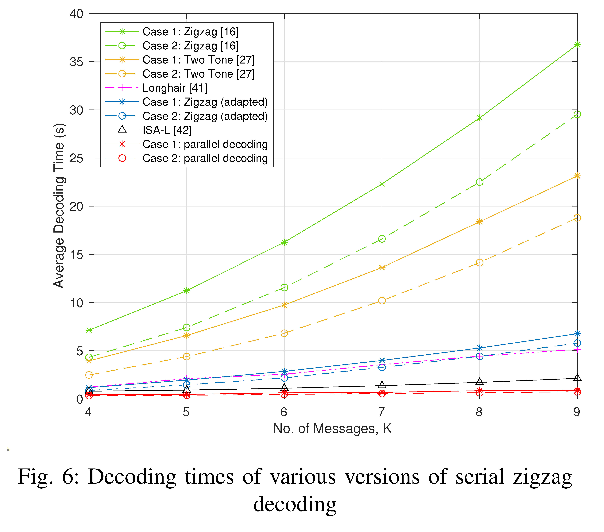
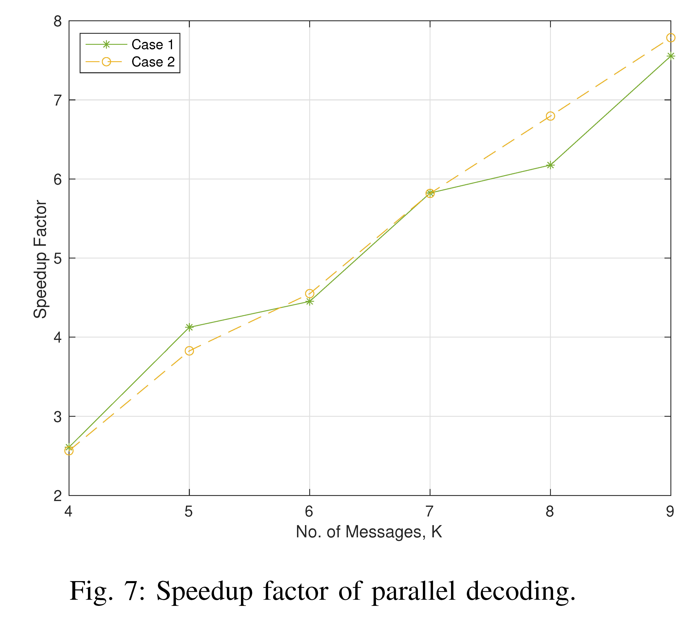

# Parallel Zigzag Decoding

High-throughput C++ showcase for a lock-free parallel decoder in distributed storage.

This repository is an engineering extraction of the decoding core behind the IEEE TIFS paper [A New Shift-Add Secret Sharing Scheme for Partial Data Protection With Parallel Zigzag Decoding](https://ieeexplore.ieee.org/document/10739341). The work targets a specific shift-add zigzag code family whose structure breaks the usual serial dependency chain in zigzag decoding.

The result: decoding is organized as row-local passes plus one anchor-row recovery pass, reducing synchronization from per-element coordination to constant phase boundaries.

## Highlights

- Lock-free hot path for the parallel decoder
- `O(1)` phase synchronization instead of `O(L)` loop synchronization
- Linear-speedup-oriented design for multi-core CPUs
- Cache-friendly contiguous row-major packet storage
- No file I/O in the benchmark path
- Configurable shard count, stripe length, thread count, and decoder mode
- Cross-platform CMake build
- Correctness tests for 4-9 shard configurations

## Why This Is Fast

Conventional zigzag decoding is dependency-heavy: each recovered symbol can depend on recently recovered symbols from other rows. A naive parallel implementation quickly turns into barrier traffic.

This implementation uses the structure of the proposed shift-add zigzag code to split recovery into three phases:

1. Independent row-local prefix transforms
2. A compact anchor-row reconstruction pass
3. Independent row-local XOR finalization

Worker threads mostly walk separate contiguous memory regions. That means low synchronization pressure, predictable access patterns, and high cache locality.

This is not a generic erasure-code framework. It is a focused performance implementation for the code construction studied in the paper.

## Results

The original experiments compare the proposed decoder against mainstream baselines and against its own serial variant. Full methodology and theory are in the paper.





## Tech Stack

- C++17
- CMake 3.20+
- Optional OpenMP acceleration
- RAII-managed contiguous memory
- Deterministic in-memory source generation
- CLI benchmark runner with CSV output

## Project Layout

```text
.
|-- include/pde/           Public codec API
|-- src/                   Core implementation
|-- benchmarks/            Parameterized benchmark executable
|-- tests/                 Correctness regression tests
|-- docs/assets/           Experiment figures
|-- CMakeLists.txt
`-- README.md
```

## Build

```bash
cmake -S . -B build -DCMAKE_BUILD_TYPE=Release
cmake --build build --config Release
ctest --test-dir build -C Release --output-on-failure
```

Host-tuned release build:

```bash
cmake -S . -B build -DCMAKE_BUILD_TYPE=Release -DPDE_NATIVE_ARCH=ON
cmake --build build --config Release
```

OpenMP is enabled when the compiler toolchain provides it. If OpenMP is missing, the project still builds and runs with the same algorithmic path in sequential row execution.

## Run Benchmarks

```bash
# Linux/macOS single-config generators
./build/pde_bench --shards 8 --elements 50000000 --threads 8 --decoder lockfree

# Windows/MSVC multi-config generators
.\build\Release\pde_bench.exe --shards 8 --elements 50000000 --threads 8 --decoder lockfree
```

Compare serial vs lock-free parallel:

```bash
./build/pde_bench --shards 8 --elements 50000000 --threads 8 --decoder compare
```

CSV mode for plotting:

```bash
./build/pde_bench --shards 8 --elements 50000000 --threads 8 --decoder compare --csv
```

## Benchmark Output

| Field | Meaning |
|---|---|
| `decoder` | `serial` or `lockfree` |
| `shards` | Number of encoded rows |
| `elements` | Elements per row |
| `threads` | Worker threads requested by the benchmark |
| `avg_ms` | Average decode latency |
| `min_ms` | Best decode latency |
| `throughput_gib_s` | Decoded matrix bytes per second |
| `verified` | Post-decode equality check against deterministic source |

## Core API

```cpp
#include "pde/codec.hpp"

pde::CodecConfig config{
    .shards = 8,
    .elements = 50'000'000,
};

pde::Matrix source = pde::make_monotonic_source(config);
pde::Matrix encoded = pde::encode(source);

pde::decode_lockfree_parallel(encoded, 8);
```

## Engineering Delta

This codebase replaces the original experiment scripts with a clean systems project:

- One reusable library target
- One parameterized benchmark binary
- No source edits for experiment scale changes
- No Windows-only timing API
- No giant text files in the hot path
- Continuous correctness checks through CTest

## Paper

J. Chen, Y. Shen, and C. Wan Sung, "A New Shift-Add Secret Sharing Scheme for Partial Data Protection With Parallel Zigzag Decoding," IEEE Transactions on Information Forensics and Security, vol. 19, pp. 10221-10232, 2024.

- IEEE Xplore: <https://ieeexplore.ieee.org/document/10739341>
- DOI: <https://doi.org/10.1109/TIFS.2024.3488498>

## License

TBD.
